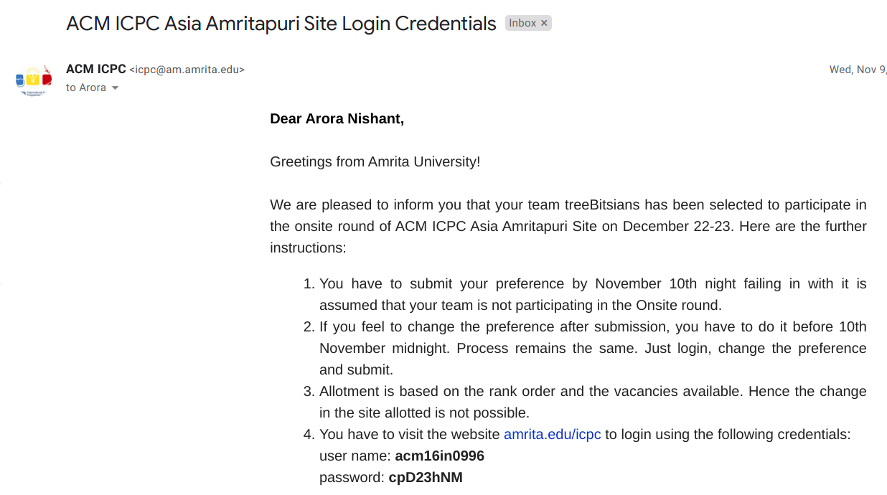

I started competitive programming at the start of my second year in college. I had just learned cpp in the vacations after my first year ended. I had mechanical engineering so I knew if I want to get good at programming, I will need to do it myself by putting in hours, practicing as much as possible. So I started that, solving problems on SPOJ everyday and neglecting all of my university coursework which obviously wasn’t a good idea. Anyway, I started loving programming more with every problem I solved. The green status on an online judge stating that my solution has been accepted was the best feeling those days.

After spoj, I moved on to codeforces and hackerrank and started solving a lot of problems there. I came to know about ICPC and got to know how big of a deal it is. Quite simply, it is the oldest, largest, and most prestigious programming contest in the world. I set a target for myself to qualify for the regionals next year where few teams from all over the country are invited. Just kept on practicing and getting better, but to participate in icpc, a team of three is needed. I had to start looking for potential teammates as my close friends weren’t into competitive programming. I was on the look for teammates and that search ended when I got a ping from hackerrank from a random user I didn’t know of, asking me to join their team. Turned out that he was one year senior to me and texted me because he liked my hackerrank profile. He already had his batchmate in his team, needed a last member, and offered me to join. I agreed and I finally had a team, with two seniors of mine.

We didn’t practice a lot together, just a few contests. We divided topics and practiced on them individually. The day of the online qualifying contest was getting close and I was getting more nervous every passing day. I really wanted this and that put some pressure on me. So the day of the online contest finally arrived. The contest was for 3 hours with 7 problems to solve. We knew that if we solve 5 of them correctly, we’ll have a really really good chance to qualify, that’s what the past years’ data told us. Teams who solved 4 problems had also qualified before, not all but some teams which solved 4 problems the fastest. So yeah, solving 5 problems correctly was the target.

The contest was supposed to start at 7 PM, I packed my laptop, charger, keyboard and went to my teammate’s hostel room. I was really nervous, didn’t even take out the keyboard the whole time and just used the laptop. The last few minutes waiting for the contest start countdown to go to 00:00:00 felt really long. Finally, it started and we were off. So 7 problems, ideally in increasing order of difficulty, and the target was to solve at least 5. I read the statement of problem1 and it was an easy implementation problem, I said I’ll code and submit it while my teammates look at problem2. It was an easy problem, I coded it and submitted it but bam, wrong answer!
I messed up the easiest problem, got WA which costs some penalty and is crucial to break ties. Told my teammates about the WA, they told me to stay calm and not be nervous. We looked at the code I submitted and it was a stupid wrong operator mistake. One of the teammates fixed and resubmitted it while I started looking at problems 2 and 3 with the other teammate. Those were slightly more difficult problems, I was able to figure out the logic for them and we solved them correctly. That gave me confidence and some boost in morale.

Now problems 4 and 5 were next which were supposed to be tough. 4 was a dp problem and 5 was regarding bipartite graphs. One teammate solved 4 correctly while I was solving 2 and 3 with the other teammate. We had 4 problems solved in around 2 hours and we had an hour left to solve at least one more problem, which was good. My teammates started looking at 5 while I started looking into 6 and 7, trying to understand the questions. We knew 6 and 7 would be extremely tough and that we need to solve 5. My teammates were implementing a complicated dp + sets solution for that bipartite graph problem, they got 2 wrong answers. I started looking at 5 too then, we had to solve it. I started coding a totally different approach from theirs, I was implementing a greedy solution for the graph problem after being fairly confident that it will work. I showed it to them before submitting it, they agreed with the logic but weren’t confident because of the thought that problem5 which is supposed to be hard will have such a simple cheeky solution. Anyway, i submitted it and got WA. Quickly debugged it, found a stupid bug, fixed it, and resubmitted it while praying that it works now.
WA again! Started debugging again but could not find any bug. Changed nothing and submitted it again 😛 Cause why not, we were running out of ideas, 2 totally different approaches had given 2 WAs each.
I was trying so hard to think what’s wrong with my solution if i was missing something. We had just 10 mins left, it had become really frustrating, it seemed like this is likely it, 4 problems only. Frustrated and hungry, one of the teammates suggested let’s go to the night canteen and eat.

I was reluctant, I wanted to keep on trying but I nodded. I closed my laptop, packed my bag and we started walking towards the night canteen talking about our chances of qualifying having solved 4 problems. The chances were minor and we weren’t optimistic at all, I was feeling sad. We reached the canteen and could hear a lot of students discussing the contest problems, some looking sad, some happy. I ordered chicken pasta to cheer myself up but it didn’t help, I was just wondering about our chances to qualify. We finished eating and I started the long walk towards my hostel reading the live commentary of the Barcelona-Valencia game which took place while the contest was going on. Barcelona had won the game in the last minutes through a Messi penalty which was cool.

A day passed by with me still thinking about the contest, going through the ranklist, trying to statistically calculate our chances of qualification. At night, I was browsing through random stuff, the usual, and I went to the contest ranking page again and refreshed it. It shocked me to see that our rank was suddenly much better than before, I didn’t realise what happened until I saw a green tick mark ahead of problem5 instead of the red cross before. Now this was very weird and surprising, had never seen something like this before. It showed that my greedy solution to the bipartite graph problem was accepted which gave 2 WAs the previous day during the live contest. I was really curious to know what had happened, I started searching and found on the codechef page that one of the test cases which was supposed to be an edge test case for the problem was wrong. That test case took N as 0 but in the problem, it was mentioned that the range is between 1 to some large number. It finally started making sense and it was a crazily happy moment. We had 5 problems solved which almost surely guaranteed our qualification!

I immediately called my teammates to tell them, they were shocked but happy of course. I was so happy, didn’t know what to do now so went to the night canteen and ordered a chicken pasta, this time to celebrate.

This email surely is a very good contender for the email which has given me the most joy till present. It was official at this point, we got the Mysore site and we were soon booking flight tickets to Bangalore! It was an incredible experience at the onsite, maybe I will write about it in another post someday. Till then, ciao!